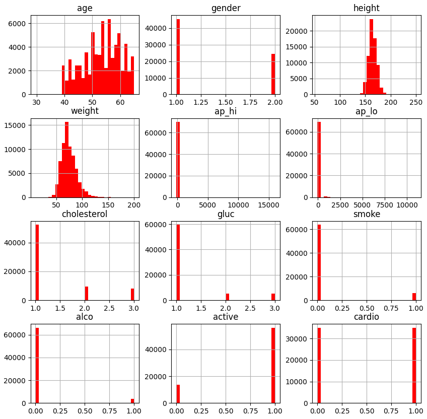
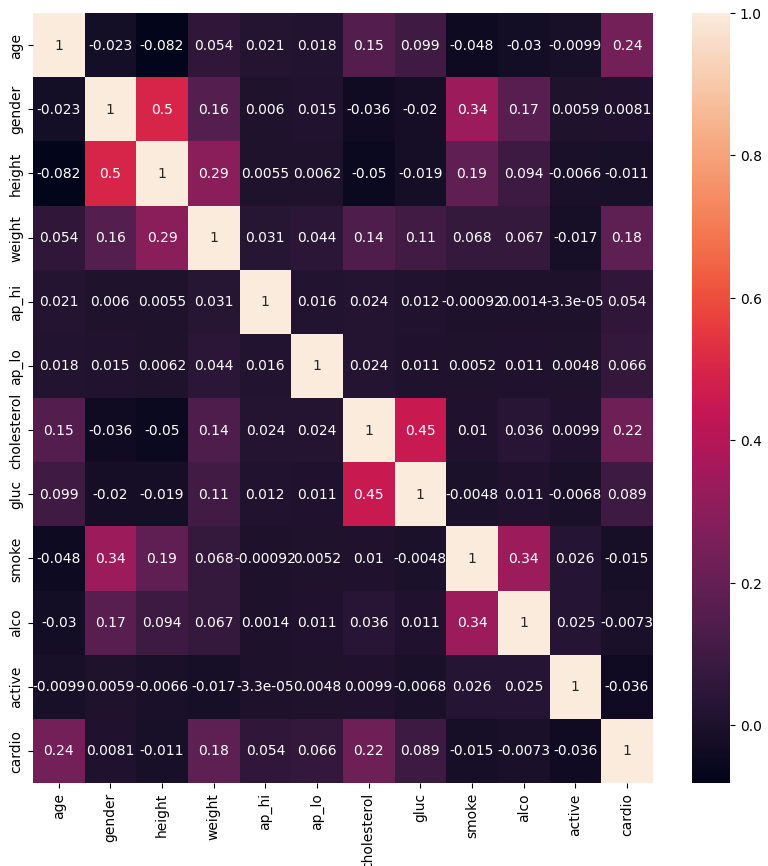
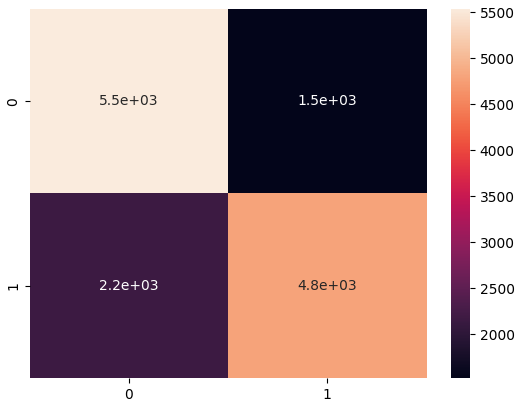
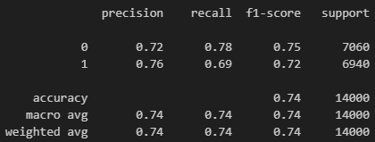

# Cardiovascular Disease Prediction Model

This project is a machine learning model designed to predict the presence of cardiovascular diseases based on health-related data. The implementation utilizes Python libraries for data preprocessing, visualization, and model building. Below is a comprehensive description of the technologies, frameworks, and methodologies used in this project.

---

## 📊 Features and Methodologies

### Data Preprocessing
- **Pandas**: Used for loading, cleaning, and manipulating the dataset.
- **NumPy**: Utilized for numerical operations and data transformations.
- **Data Cleaning**: Removed unnecessary columns (e.g., `id`) and converted age from days to years for better interpretability.

### Data Visualization
- **Matplotlib**: Used for creating visual representations of data distributions and results.
- **Seaborn**: Leveraged to generate a heatmap for the correlation matrix, enabling insight into feature relationships.

### Machine Learning
- **XGBoost (XGBClassifier)**: A powerful gradient-boosting algorithm used for classification tasks.
  - Parameters:
    - Objective: `binary:logistic` for binary classification.
    - Evaluation Metric: `error`.
    - Hyperparameters: `learning_rate=0.1`, `max_depth=10`, `n_estimators=10`.
- **Train-Test Split**: Split data into training (80%) and testing (20%) subsets using `train_test_split` from Scikit-learn.

### Model Evaluation
- **Scikit-learn**:
  - Used to calculate accuracy, precision, recall, F1-score, and confusion matrix.
  - `classification_report` provided a detailed evaluation of the model's performance.
  - Visualized confusion matrix with a heatmap for easy interpretation.

---

## ⚙️ Project Setup

1. Clone this repository:
   ```bash
   git clone https://github.com/sudarshan-raveendranath/scikit-learn-for-classification-problems.git

|  |  |
|:--------------------------------------------------------:|:-----------------------------------------------------------:|
| **Data Distribution**                                   | **Correlation Matrix Heatmap**                              |

|   |  |
|:--------------------------------------------------------:|:-----------------------------------------------------------:|
| **Confusion Matrix**                                    | **Performance Metrics**                                     |
