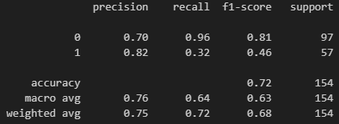

# Cardiovascular Disease Prediction Model

This project is a machine learning model designed to predict the presence of cardiovascular diseases based on health-related data. The implementation utilizes Python libraries for data preprocessing, visualization, and model building. Below is a comprehensive description of the technologies, frameworks, and methodologies used in this project.

---

## 📊 Features and Methodologies

### Data Preprocessing
- **Pandas**: Used for loading, cleaning, and manipulating the dataset.
- **NumPy**: Utilized for numerical operations and data transformations.
- **Data Cleaning**: Removed unnecessary columns (e.g., `id`) and converted age from days to years for better interpretability.

### Data Visualization
- **Matplotlib**: Used for creating visual representations of data distributions and results.
- **Seaborn**: Leveraged to generate a heatmap for the correlation matrix, enabling insight into feature relationships.

### Machine Learning
- **XGBoost (XGBClassifier)**: A powerful gradient-boosting algorithm used for classification tasks.
  - Parameters:
    - Objective: `binary:logistic` for binary classification.
    - Evaluation Metric: `error`.
    - Hyperparameters: `learning_rate=0.1`, `max_depth=10`, `n_estimators=10`.
- **Train-Test Split**: Split data into training (80%) and testing (20%) subsets using `train_test_split` from Scikit-learn.

### Model Evaluation
- **Scikit-learn**:
  - Used to calculate accuracy, precision, recall, F1-score, and confusion matrix.
  - `classification_report` provided a detailed evaluation of the model's performance.
  - Visualized confusion matrix with a heatmap for easy interpretation.

---

## ⚙️ Project Setup

1. Clone this repository:
   ```bash
   git clone https://github.com/sudarshan-raveendranath/scikit-learn-for-classification-problems.git

|  |  |
|:--------------------------------------------------------:|:-----------------------------------------------------------:|
| **Data Distribution**                                   | **Correlation Matrix Heatmap**                              |

|   |  |
|:--------------------------------------------------------:|:-----------------------------------------------------------:|
| **Confusion Matrix**                                    | **Performance Metrics**                                     |

# Diabetes Prediction Model

## Overview

This project involves building a machine learning model to predict whether a person has diabetes or not based on a set of health-related features. The model uses the **XGBoost** classifier, a powerful implementation of gradient boosting, to classify data from the **Pima Indians Diabetes Database**. The dataset contains several medical attributes (such as glucose level, BMI, age, etc.) and the outcome variable, which indicates whether a person has diabetes (`1`) or not (`0`).

## Technologies & Frameworks

- **Python**: The programming language used for building the model and performing data analysis.
- **Pandas**: Used for data manipulation and analysis, including data cleaning and feature extraction.
- **NumPy**: A library used for numerical operations and array handling.
- **Matplotlib**: A plotting library used to create static, interactive, and animated visualizations in Python.
- **Seaborn**: Built on top of Matplotlib, it provides a high-level interface for drawing attractive and informative statistical graphics.
- **XGBoost**: The machine learning algorithm used for classification. It’s an efficient and scalable implementation of gradient boosting.
- **Scikit-learn**: A powerful machine learning library used for data preprocessing, model evaluation, and metrics calculation.

## Dataset

The dataset used in this model is the **Pima Indians Diabetes Database**, which contains the following columns:

- **Pregnancies**: Number of times pregnant
- **Glucose**: Plasma glucose concentration after a 2-hour oral glucose tolerance test
- **BloodPressure**: Diastolic blood pressure (mm Hg)
- **SkinThickness**: Skinfold thickness (mm)
- **Insulin**: 2-Hour serum insulin (mu U/ml)
- **BMI**: Body mass index (weight in kg / height in m²)
- **DiabetesPedigreeFunction**: A function that represents the family history of diabetes
- **Age**: Age of the person
- **Outcome**: Target variable (1 if diabetic, 0 if not)

## Model Building Process

### 1. Data Preprocessing

The dataset is loaded using **Pandas**, and the necessary preprocessing steps are performed:

- The `Outcome` column, which is the target variable, is separated from the features.
- Exploratory Data Analysis (EDA) is performed to understand the relationships between different features and the target variable, including visualizations like histograms and a correlation heatmap.

### 2. Feature Selection

The features are selected by dropping the `Outcome` column, which is the target variable. The remaining columns represent the independent variables used to predict diabetes.

### 3. Train-Test Split

The dataset is split into training and testing sets using **Scikit-learn’s `train_test_split`** function, with 80% of the data used for training and 20% used for testing.

### 4. Model Training

The **XGBoost** classifier is used to train the model. The model is configured with the following hyperparameters:

- **Objective**: `'binary:logistic'` for binary classification.
- **Eval Metric**: `'error'` to calculate the classification error.
- **Learning Rate**: `0.1`, which controls the speed of learning.
- **Max Depth**: `1` to avoid overfitting and ensure simpler trees.
- **N Estimators**: `10` to use 10 boosting rounds (trees).
- **Use Label Encoder**: `False` to avoid warnings related to label encoding.

### 5. Model Evaluation

After training, the model's performance is evaluated using the test set. The **accuracy** of the model is printed, and additional metrics like precision, recall, and F1-score are calculated using **Scikit-learn’s `classification_report`**. A **confusion matrix** is also generated to visually assess the model's classification performance.

### 6. Model Visualization

- **Confusion Matrix**: A heatmap of the confusion matrix is displayed using **Seaborn** to visualize the true positives, false positives, true negatives, and false negatives.

## Model Output

- **Accuracy**: The percentage of correctly classified instances in the test set.
- **Classification Report**: Precision, recall, and F1-score metrics for each class (`0` or `1`).
- **Confusion Matrix**: A heatmap of the confusion matrix showing the model's predictions vs. the true outcomes.

## ⚙️ Project Setup

1. Clone this repository:
   ```bash
   git clone https://github.com/sudarshan-raveendranath/scikit-learn-for-classification-problems.git

|  |  |
|:--------------------------------------------------------:|:-----------------------------------------------------------:|
| **Data Distribution**                                   | **Correlation Matrix Heatmap**                              |

|   |  |
|:--------------------------------------------------------:|:-----------------------------------------------------------:|
| **Confusion Matrix**                                    | **Performance Metrics**                                     |
